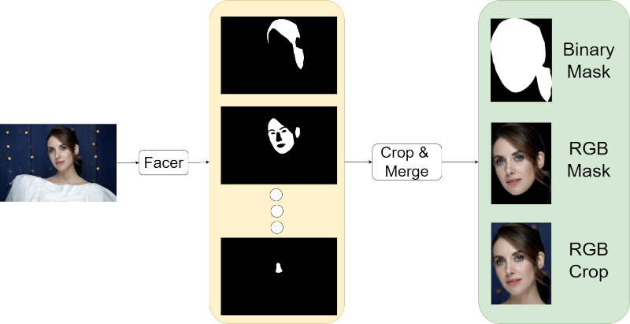
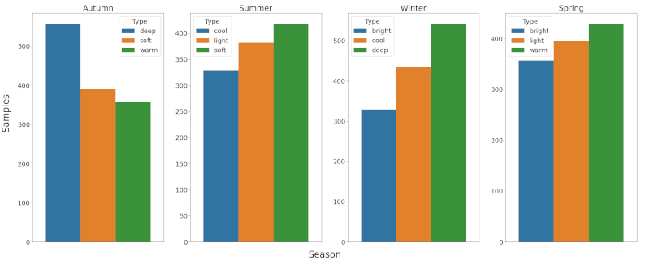

# Deep Armocromia Dataset 

*ECCV 2024*

**[University of Macerata](https://www.unimc.it/en?set_language=en), [Vision Robotics and Artificial Intelligence (VRAI) Lab](https://vrailab.it/)**

[Lorenzo Stacchio](https://scholar.google.com/citations?user=oHkM91kAAAAJ&hl=it&oi=ao), [Marina Paolanti](https://scholar.google.com/citations?user=Q_16CysAAAAJ&hl=it&oi=ao), [Francesca Spigarelli](https://scholar.google.com/citations?user=kIzyjqsAAAAJ&hl=it&oi=ao), [Emanuele Frontoni](https://scholar.google.com/citations?user=Vgi8nAcAAAAJ&hl=it&oi=ao).

<!--[[`Paper`](https://ai.meta.com/research/publications/sam-2-segment-anything-in-images-and-videos/)] [[`Project`](https://ai.meta.com/sam2)] [[`Dataset`](https://ai.meta.com/datasets/segment-anything-video)] [[`Blog`](https://ai.meta.com/blog/segment-anything-2)] [[`BibTeX`](#citing-sam-2)]-->

[[`Paper`](https://www.researchgate.net/publication/383463705_Deep_Armocromia_A_Novel_Dataset_for_Face_Seasonal_Color_Analysis_and_Classification)] [[`Project Page`](https://lorenzo-stacchio.github.io/Deep-Armocromia/)] [[`Reference`](#reference)]


<p align="center">
   </img>
  <a> Figure 1: Deep Armocromia examples.</a>
</p>

<p align="justify">
Deep Armocromia is a novel dataset comprising labeled face images categorized according to Armocromia Flow Theory, with a strict annotation protocol in collaboration with experts.

We conducted experiments to validate the effectiveness of DL models in discriminating among Armocromia classes optimized on Deep Armocromia. Results underscore the challenges inherent to Armocromia classification and highlight opportunities for advancing DL architectures and optimization methodologies.

We release this dataset here for scientific and research purposes only. 
 </p>

<!--*<sub>From (1) to (4), each row represents clothes images with different variations. At each row, we partition the images into two groups, the left three columns represent clothes from commercial stores, while the right three columns are from customers.In each group, the three images indicate three levels of difficulty with respect to the corresponding variation.Furthermore, at each row, the items in these two groups of images are from the same clothing identity but from two different domains, that is, commercial and customer.The items of the same identity may have different styles such as color and printing.Each item is annotated with landmarks and masks.*-->

# Announcements
* 2024-09 The dataset requests will be accomplished after the paper presentation at ECCV 2024!
* 2024-08 The paper is accepted at ECCV 2024 [Fashion AI Workshop](https://sites.google.com/view/fashionai2024) !

 
# Dataset Download
The Deep Armocromia dataset is available in [Deep Armocromia Google Drive Folder](https://drive.google.com/drive/folders/1QuFJqNxhbLVME5UyUjDGYHQ1ntAqgniT?usp=sharing). You need to fill in the [form](https://forms.gle/icac2opCYqF79RyE9) to get the password for unzipping files. Please take a look at the Data Description below for detailed information about the dataset.

**Please note that the labels for the 4 Season labeling were written in Italian, their English translation here follows**:

* Primavera: Spring
* Estate: Summer
* Autunno: Autumn
* Inverno: Winter


# Dataset Organization
Each image has a unique entry into the corresponding ```annotations.csv``` file which provides the following annotations:

### `class`
- **Description**: Represents the primary classification label for the dataset entry.
- **Example**: `autunno`
- **Notes**: In this context, it appears to refer to a color season classification.

### `sub_class`
- **Description**: Indicates a secondary classification within the primary class, providing more detailed categorization.
- **Example**: `deep`
- **Notes**: It specifies a sub-category within the main class, further refining the classification.

### `partition`
- **Description**: Specifies the data partition to which the entry belongs, such as training, validation, or test sets.
- **Example**: `train`
- **Notes**: This is used to organize the data for different stages of model development and evaluation.

### `celeba`
- **Description**: A boolean value indicating whether the entry belongs to the CelebA dataset.
- **Example**: `True`
- **Notes**: This is a metadata field used to identify the origin of the image.

### `path_rgb_original`
- **Description**: The file path to the original RGB image in the dataset.
- **Example**: `MERGED_RGB_original/train/autunno/deep/10306.jpg`
- **Notes**: This points to the unmodified original version of the image.

### `path_rgb_masked`
- **Description**: The file path to the RGB image with applied masks.
- **Example**: `MERGED_masked_RGB_BBOXED/train/autunno/deep/10306.png`
- **Notes**: This image has masks applied to it, likely for training purposes involving masked regions.

### `path_mask`
- **Description**: The file path to the mask image used in the dataset.
- **Example**: `MERGED_mask_BBOXED/train/autunno/deep/10306.png`
- **Notes**: This path points to the binary mask image, indicating the regions of interest within the original image.

Please note that all the images amounting to fashion parsing binary masks were extracted with the pre-trained models released in the [FACER](FACER) toolbox, adopting the method reported in the following Figure 2:


<p align="center">
  
  <a> Figure 2: Dataset Face Parsing Mask Extraction process.</a>
</p>

*<sub> All the generated mask were analyzed by human experts, that removed the uncorrectly predicted face parsing segmentation masks.*

<!--# Data Description

Dataset partition: 
* Training images: <dataset_type>/train/image              
* Test images: <dataset_type>/test/image
* Training/Test annotations: annotations.csv


Each image is either taken from Celeb-A dataset or manually annotated by scraping and downloading images from instagram. Since filepaths does not follow a pre-defined rule, often refer to the ```annotations.csv``` to know the all infos about a single image.-->

# Dataset Statistics
Figure 3 shows the statistics of images and annotations in Deep Armocromia, according to the 4 color seasons and 12 seasonal sub-types (For more precise statistics please refer to the manuscript).

<p align="center">
  
  <a> Figure 3: Deep Armocromia Dataset Statistics.</a>
</p>

<!--| | Train | Validation | Test | Overall |  
|---:|---:|---:|---:|---:|
|images|390,884|33,669|67,342|491,895|
|bboxes|636,624|54,910|109,198|800,732|
|landmarks|636,624|54,910|109,198|800,732|
|masks|636,624|54,910|109,198|800,732|
|pairs|685,584|query: 12,550<br/>gallery: 37183|query: 24,402<br/>gallery: 75,347|873,234|-->

<!--# Benchmarks
## Clothes Detection
This task detects clothes in an image by predicting bounding boxes and category labels to each detected clothing item.
The evaluation metrics are the bounding box's average precision <a href="https://www.codecogs.com/eqnedit.php?latex=$&space;{AP}_{box}$" target="_blank"></a>,<a href="https://www.codecogs.com/eqnedit.php?latex=${AP}_{box}^{IoU=0.50}$" target="_blank"></a>,<a href="https://www.codecogs.com/eqnedit.php?latex=${AP}_{box}^{IoU=0.75}$" target="_blank"></a>.

<p align='center'>Table 2: Clothes detection trained with released DeepFashion2 Dataset evaluated on validation set.</p>-->


# Reference

If you use the DeepArmocromia dataset in your work, please cite it as:

## Bibtex
```
@inproceedings{stacchio2024deep,
  title={Deep Armocromia: A Novel Dataset for Face Seasonal Color Analysis and Classification},
  author={Lorenzo Stacchio and
          Marina Paolanti and
          Francesca Spigarelli and
          Emanuele Frontoni},
  booktitle={European Conference on Computer Vision (ECCV) Workshops},
  pages={xxx--yyy},
  year={2024},
  organization={Springer}
}

```

## APA
```
Stacchio, L., Paolanti, M., Spigarelli, F., & Frontoni, E. (2024). Deep Armocromia: A novel dataset for face seasonal color analysis and classification. In European Conference on Computer Vision (ECCV) Workshops, (pp. xxx-yyy). Springer.
```
